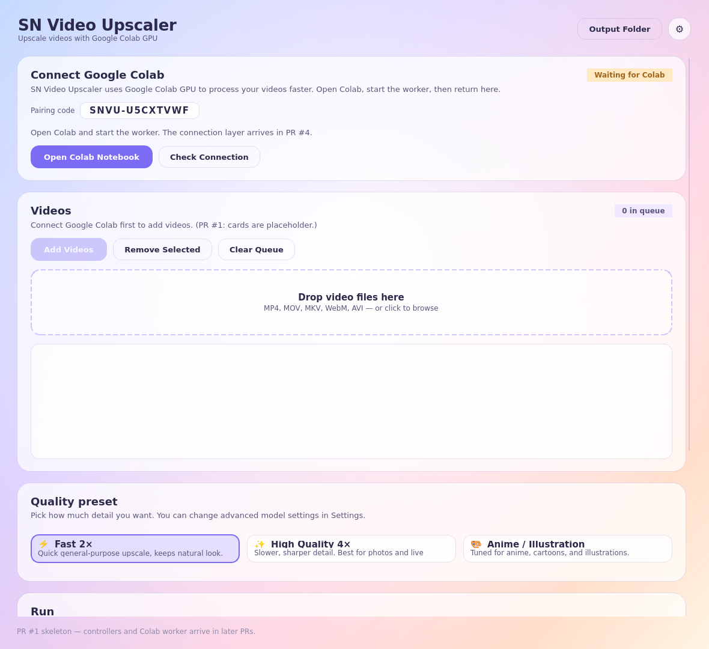

# SN Video Upscaler

Windows desktop app that upscales videos with **Google Colab GPU** —
a friendly EXE on your PC, the heavy GPU work in Colab.

This repo is being built up in small, reviewable PRs. **PR #1 + PR #2**
landed the desktop app skeleton + final UI/UX. **PR #3A** adds the
Google Colab worker notebook foundation (boot + GPU check + `/health`
endpoint). Real upload / processing / download lands in PR #3B + #4 + #5/6.



## What's in PR #1

- **Project setup**: `pyproject.toml`, `.gitignore`, ruff + pytest config.
- **Base desktop window** (PySide6) with the soft-pastel gradient and
  the radial glow behind the content.
- **Five glass cards in placeholder mode**:
  1. *Connect Google Colab* — header, status pill (`Waiting for Colab`),
     pairing code display, *Open Colab Notebook* + *Check Connection*
     buttons (clicks log to the activity line).
  2. *Videos* — drag-and-drop zone, file list, *Add Videos* /
     *Remove Selected* / *Clear Queue* (disabled until PR #4 lands the
     real Colab connection — for review, the queue can still be exercised
     because the disabled gating is just a flag).
  3. *Quality preset* — Fast 2× / High Quality 4× / Anime / Illustration
     radio cards.
  4. *Run* — Start, Pause, Stop, Retry Failed, Open Output Folder
     buttons.
  5. *Progress* — current-file label, three progress bars (Uploading,
     Processing on GPU, Downloading result), Completed / Failed /
     Remaining counts, and an activity line.
- **Header**: app title, subtitle "Upscale videos with Google Colab GPU",
  *Output Folder* shortcut, and a settings cog (placeholder).
- **In-memory `AppSettings`** with default output folder and a generated
  pairing code (`SNVU-XXXXXXXX`).
- **Smoke tests** (`tests/test_skeleton.py`).
- **`docs/screenshot.png`** of the running skeleton.

## Roadmap

- ~~**PR #1** — Project setup + Windows desktop app skeleton.~~
- ~~**PR #2** — Final UI/UX polish (premium glassmorphism, hero Connect card).~~
- ~~**PR #3A** — Google Colab worker notebook foundation (`/health`).~~
- **PR #3B** — Real-ESRGAN install + single-video pipeline (`/upscale`, `/status`, `/download`).
- **PR #4** — Desktop ↔ Colab connection (auto-discovery via ntfy.sh).
- **PR #5** — Single video upload → process → download (desktop side).
- **PR #6** — Batch queue, one-by-one.
- **PR #7** — Polish, error handling, Windows EXE packaging, README, QA.

## Run the desktop app from source

Requires Python 3.10+.

```bash
# Clone
git clone https://github.com/tuyulyak-collab/sn-video-upscaler.git
cd sn-video-upscaler

# Virtualenv + install
python -m venv .venv
# Windows:
.venv\Scripts\activate
# macOS / Linux:
source .venv/bin/activate

pip install -e ".[dev]"

# Run the app
sn-video-upscaler
# or:
python -m sn_video_upscaler.main
```

### Lint and tests

```bash
ruff check desktop tests scripts
pytest tests
```

## Run the Colab worker (PR #3A)

The notebook lives at `colab/sn_video_upscaler_colab_worker.ipynb`.
Full instructions are in [`colab/README.md`](colab/README.md). TL;DR:

1. Open the notebook in Google Colab.
2. Runtime → Change runtime type → **GPU** → Save → Connect.
3. Run the *Setup* cells, then *Start Worker*.
4. The cell prints a `https://*.trycloudflare.com` URL.
5. Verify with `curl <url>/health`.

The `.ipynb` is generated from `colab/source/notebook.py`. Re-run
`python scripts/build_notebook.py` after edits.

## What's still placeholder

- **Connect Google Colab card.** Status is hard-coded to "Waiting for Colab".
  Buttons emit signals but do not open a notebook or probe a worker. (PR #3, #4)
- **Videos card.** Disabled by default with the helper text
  "Connect Google Colab first to add videos". The Add / Remove / Clear
  flow itself works on a `list[str]` of file paths but does not upload
  anything yet. (PR #5/#6)
- **Run card.** Buttons log to the activity line and update the progress
  bars are not wired to a real worker. (PR #5, #6)
- **Progress card.** Bars and counts are inert in the skeleton. (PR #5, #6)
- **Settings cog.** Pops a "coming in a later PR" message. (PR #7)
- **Output folder shortcut** does open the configured folder with the
  platform's file manager.
- **`AppSettings`** is in-memory only. JSON persistence under
  `platformdirs.user_config_dir(...)` lands in PR #7.

## Project structure

```
desktop/sn_video_upscaler/
├── __init__.py
├── main.py
├── theme.py
├── settings.py
└── ui/
    ├── widgets.py        # GradientBackground, GlassCard, StatusPill, DropZone, ...
    ├── main_window.py    # Composes the cards
    ├── colab_card.py     # Connect Google Colab
    ├── queue_card.py     # Videos (drag-drop, list, add/remove/clear)
    ├── preset_card.py    # Quality preset (Fast 2×, High Quality 4×, Anime)
    ├── start_card.py     # Run controls
    └── progress_card.py  # Bars + counts + activity line
colab/
├── sn_video_upscaler_colab_worker.ipynb   # generated notebook
├── source/notebook.py                     # source (cell markers)
└── README.md
scripts/
└── build_notebook.py     # converts source/notebook.py -> .ipynb
docs/
└── screenshot.png        # main window
tests/
├── test_skeleton.py      # desktop smoke tests
└── test_notebook.py      # notebook structure tests
pyproject.toml
README.md
```

## License

MIT.
